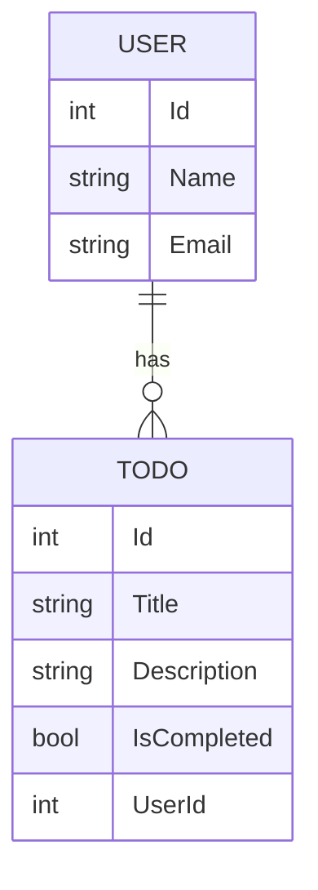

// generate ER diagram from the models in the project, surronded by mermaid tags

```mermaid

erDiagram
    USER {
        int Id
        string Name
        string Email
    }
    TODO {
        int Id
        string Title
        string Description
        bool IsCompleted
        int UserId
    }
    USER ||--o{ TODO : has
```