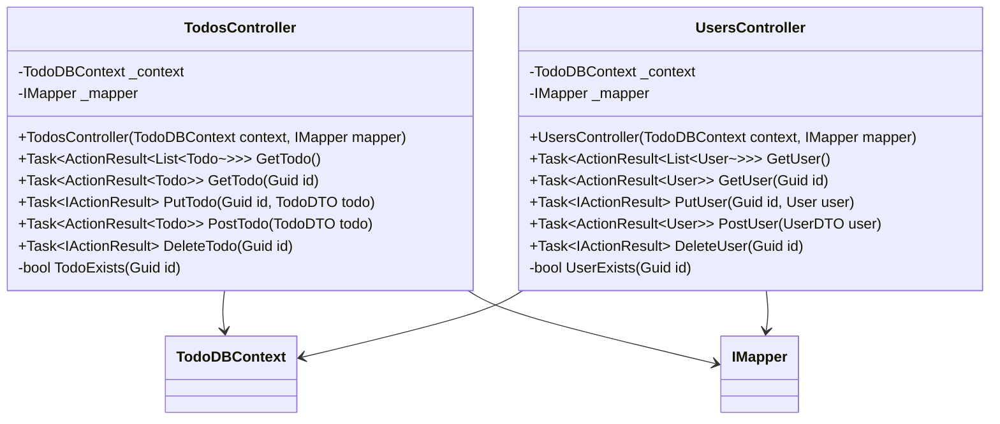

//surround the below code with ```mermaid and ``` to render it as a diagram

```mermaid


classDiagram
    class TodosController {
        -TodoDBContext _context
        -IMapper _mapper
        +TodosController(TodoDBContext context, IMapper mapper)
        +Task~ActionResult~List~Todo~~~~ GetTodo()
        +Task~ActionResult~Todo~~ GetTodo(Guid id)
        +Task~IActionResult~ PutTodo(Guid id, TodoDTO todo)
        +Task~ActionResult~Todo~~ PostTodo(TodoDTO todo)
        +Task~IActionResult~ DeleteTodo(Guid id)
        -bool TodoExists(Guid id)
    }

    class UsersController {
        -TodoDBContext _context
        -IMapper _mapper
        +UsersController(TodoDBContext context, IMapper mapper)
        +Task~ActionResult~List~User~~~~ GetUser()
        +Task~ActionResult~User~~ GetUser(Guid id)
        +Task~IActionResult~ PutUser(Guid id, User user)
        +Task~ActionResult~User~~ PostUser(UserDTO user)
        +Task~IActionResult~ DeleteUser(Guid id)
        -bool UserExists(Guid id)
    }

    TodosController --> TodoDBContext
    TodosController --> IMapper
    UsersController --> TodoDBContext
    UsersController --> IMapper

```